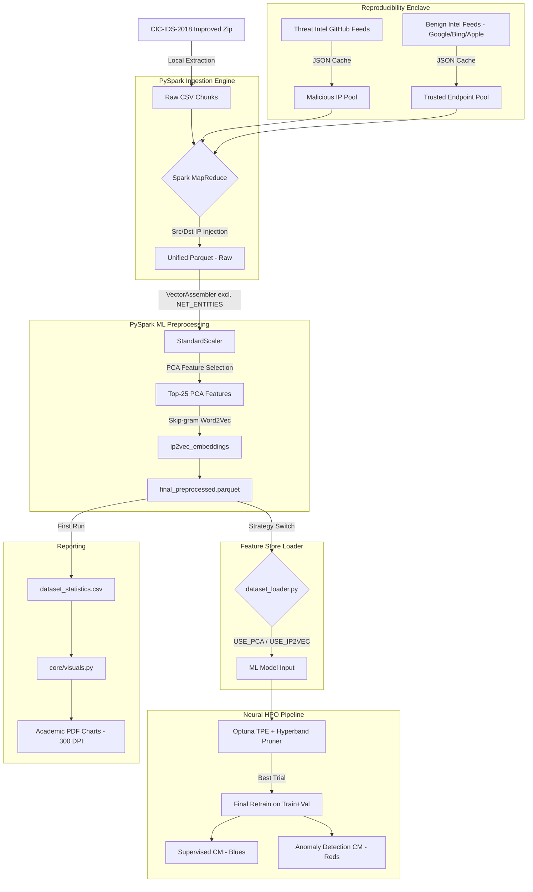

  <h1>CIC-IDS-2018 DDoS Enhanced Dataset Generator</h1>
  <p><h3>An autonomous, out-of-core pipeline for generating threat-intelligence-augmented synthetic PCAP datasets.</h3></p>

---

## 📌 Project Overview
This tool extracts the massive (~40-50GB uncompressed) **CIC-IDS-2018 improved dataset** and scales its preprocessing natively out-of-core using **PySpark MLlib**. The generator solves fundamental reproducibility and scalability issues:
1. **Zero OOM (Out-of-Memory)**: Bypasses Pandas' memory constraints by leveraging PySpark's parallel `Parquet` MapReduce mapping.
2. **Global Determinism**: A single `RANDOM_SEED` in `configs/settings.py` propagates across all PySpark sampling, PyTorch weight initialization, and Optuna trial seeds — guaranteeing identical results across runs.
3. **Reproducible Threat Intel**: Fetches dynamic IPs from public Threat Intelligence repositories but caches them via `JSON` locally to guarantee stable downstream reproducibility across dataset generations.
4. **SOTA Feature Engineering**: Applies PCA-based feature selection via **Global Variance-Weighted Importance Scoring** to distil ~75 raw features down to the most informative 25, eliminating noise before model training.
5. **Neural HPO Benchmark**: A dedicated Optuna + Hyperband search engine systematically explores four neural architectures across a rich hyperparameter space, logged end-to-end to MLflow.

---

## 🏗️ Architecture



---

## ⚙️ Core Components

| Component | Responsibility | Technical Stack |
| :--- | :--- | :--- |
| **`core/ingestion.py`** | Downloads dataset, handles unzipping. Reads raw daily CSVs using `SparkSession`, creates deterministic subnet IP pools from both **malicious** (AbuseIPDB) and **benign** (Google/Bing/Apple) threat feeds. Injects IPs into Src/Dst fields, repartitions into out-of-core `unified_records.parquet`, tagging each row with `_source_day`. | PySpark SQL, UDFs |
| **`core/dataset_loader.py`** | **Feature Store**. Loads RAW 40GB dataset lazily, applies virtual schema strategies (`raw`, `unsupervised`, `binary_collapse`, `undersample_majority`), and evaluates `USE_PCA`/`USE_IP2VEC` flags to deliver the correct feature matrix to the model. | PySpark ML DataFrame |
| **`core/preprocessing.py`** | Label encoding (`StringIndexer`), continuous feature scaling (`StandardScaler`), **SOTA PCA-based feature selection** via Global Variance-Weighted Importance Scoring, parallel PCA projection (`pca_features`). Calls `ip2vec.py` for distributed Skip-gram embedding generation. Enforces `NET_ENTITIES` isolation list. | PySpark MLlib |
| **`core/ip2vec.py`** | Transforms discrete network routing tokens into continuous latent vectors via native PySpark `Word2Vec` (Skip-gram). Applies **Token Prefixing** (`Protocol_6` vs `DstPort_6`). Performs advanced offline IP geolocation (Country/Type) leveraging **MaxMind GeoLite2** databases, accelerated by **Apache Arrow** via vectorized Pandas UDFs (`@pandas_udf`). | PySpark ML, GeoIP2, Apache Arrow |
| **`core/visuals.py`** | Dedicated visualization engine. All output is academic-standard (serif fonts, minimal grid, 300 DPI PDF/PNG). Exposes `plot_dataset_statistics()`, `plot_pca_variance()`, `plot_training_curves()`, `plot_confusion_matrix()`. | matplotlib, seaborn |
| **`core/utils.py`** | General I/O utilities: cross-tabulation report generation, feature manifest loading, temp directory cleanup. | Python stdlib |
| **`configs/settings.py`** | Central declarative point for all experiment flags: `RANDOM_SEED`, `ML_CLASS_STRATEGY`, `USE_PCA`, `USE_IP2VEC`, `PCA_FEATURE_SELECTION`, `IP2VEC_SENTENCE`. | Constants |
| **`scratch_hpo.py`** | **Neural HPO Benchmark Suite**. Hyperparameter search over MLP, ResNet-Tabular, 1D-CNN, and AutoencoderClassifier architectures using Optuna (TPE sampler + Hyperband pruner) and MLflow. Produces dual confusion matrices (Supervised + Anomaly Detection) on the best trial. | Optuna, PyTorch, MLflow |

---

## 🚀 Usage Guide

### 1. Requirements & Setup
Because the system runs on **PySpark**, your local environment must have Java runtime enabled.

```bash
# 1. Install Java (Linux/Ubuntu)
sudo apt install default-jre

# 2. Setup isolated environment
python3 -m venv .venv
source .venv/bin/activate

# 3. Install core Python dependencies
pip install -r requirements.txt
```

### 2. Execution & Configurations
Modify `configs/settings.py` to change dataset architectures. Available modes for ML Pipeline testing:

#### Global Reproducibility
```python
RANDOM_SEED = 42  # Single seed → propagated to PySpark, PyTorch, Optuna
```

#### ML Base Strategies (`ML_CLASS_STRATEGY`)
- `"raw"` — Retains 100% of rows and original multi-class labels (for XGBoost/imbalanced learners)
- `"unsupervised"` — Excludes attacks; serves pure continuous Benign baseline (for Autoencoders)
- `"binary_collapse"` — Collapses 14 attack subtypes into a single Boolean `Attack` label
- `"undersample_majority"` — Binary collapse + dynamic downsampling of Benign traffic to hit `TARGET_BENIGN_RATIO`

```python
ML_CLASS_STRATEGY = "undersample_majority"
TARGET_BENIGN_RATIO = 0.5  # 50% Benign / 50% Attack
```

#### SOTA PCA Feature Selection
PCA is used not just for dimensionality reduction, but as a **feature extraction and selection engine**. The pipeline computes a **Global Variance-Weighted Importance Score** for each original feature across all principal components and physically retains only the top-N most informative columns:

```python
PCA_FEATURE_SELECTION = True   # Enables importance-score-based feature extraction
PCA_COMPONENTS = 25            # Principal components to fit
PCA_TARGET_FEATURES = 25       # Top raw features to retain (noise features dropped)
USE_PCA = True                 # Deliver pca_features column to the model loader
```

> [!TIP]
> With ~75 original features, fitting 25 PCA components typically covers >95% of explained variance. Forcing all 75 components would capture noise and degrade downstream model generalisation.

#### Neural Embeddings & Analytics Toggles
- `USE_IP2VEC` — Provides the `ip2vec_embeddings` vector column; `NET_ENTITIES` remain excluded from StandardScaler in either case
- `IP2VEC_SENTENCE` — Context window token list for Skip-gram. Tokens are prefixed before training, so `Protocol_6` and `DstPort_6` live in completely separate embedding subspaces regardless of their numeric value
  - Available tokens: `"Src IP"`, `"Dst IP"`, `"Src Port"`, `"Dst Port"`, `"Protocol"`, `"Src Region"`, `"Dst Region"`
  - `Src Region` & `Dst Region` are computed inline via offline **MaxMind GeoLite2** lookup. Execution is vectorized through **Apache Arrow** (`pyarrow`) for extreme performance over tens of millions of rows.

Run the system:
```bash
python main.py
```

Optional CLI overrides:
- `--days`: Array of days to process (e.g. `--days Monday-12-02-2018`)
- `--force`: Ignore cached IP feeds and local parquets, rewriting everything.
- `--sample`: Set integer to downsample the final table (e.g. `--sample 500000`)
- `--no-cache`: Prevents saving the final Parquet back to the system disk.

> [!TIP]
> **Dataset Distribution Matrix**
> On first pipeline execution, a PySpark Cross-Tabulation runs seamlessly generating `data/dataset_statistics.csv` printing the intersection of all ML Labels vs the specific extraction Day they appeared on, with horizontal/vertical Marginal counters.

---

### 3. Neural Architecture HPO (Optuna + Hyperband)

A dedicated benchmarking suite explores the hyperparameter space of four neural architectures simultaneously. The search uses **TPE (Tree-structured Parzen Estimator)** for intelligent candidate selection and **Hyperband** for aggressive early-stopping of underperforming trials.

```bash
# Run HPO with a 30% sample and 30 search trials
python scratch_hpo.py --trials 30 --sample 0.3

# Run with a larger sample and more epochs per trial
python scratch_hpo.py --trials 50 --sample 0.5 --epochs 30
```

#### HPO Hyperparameter Search Space

The following parameters are varied by Optuna across **all architectures**:

| Parameter | Range | Type | Notes |
| :--- | :--- | :--- | :--- |
| `architecture` | `mlp`, `resnet`, `cnn1d`, `autoencoder` | Categorical | Model type selection |
| `use_ip2vec` | `True`, `False` | Categorical | Concatenate IP2Vec embeddings to numeric |
| `lr` | `[1e-5, 1e-2]` | Log-uniform | Learning rate |
| `optimizer` | `AdamW`, `SGD` | Categorical | SGD also tunes `momentum ∈ [0.8, 0.99]` |
| `weight_decay` | `[1e-7, 1e-3]` | Log-uniform | L2 regularisation |
| `dropout` | `[0.0, 0.5]` | Float | Applied in all architectures |

**Architecture-specific parameters:**

| Architecture | Parameter | Range | Notes |
| :--- | :--- | :--- | :--- |
| **MLP** | `mlp_n_layers` | `[2, 6]` | Hidden layer count |
| | `mlp_hidden` | `64, 128, 256, 512, 1024` | Neurons per layer |
| **ResNet** | `resnet_hidden` | `64, 128, 256, 512` | Residual block dimension |
| | `resnet_n_blocks` | `[2, 8]` | Number of skip-connection blocks |
| **CNN1D** | `cnn_filters` | `32, 64, 128` | Conv filter count |
| | `cnn_kernel` | `3, 5, 7` | 1D sliding window size |
| **Autoencoder** | `ae_hidden` | `128, 256, 512` | Encoder hidden dimension |
| | `ae_latent` | `16, 32, 64` | Bottleneck (latent space) size |

#### HPO Pruning Strategy

Hyperband eliminates underperforming trials early, comparable to early-stopping but across all parallel candidate configurations:

```python
sampler = TPESampler(seed=42, multivariate=True)
pruner  = HyperbandPruner(
    min_resource=3,        # Minimum epochs before a trial can be pruned
    max_resource=20,       # Maximum epochs per trial
    reduction_factor=3,    # Aggressiveness: larger = more pruning
)
```

After the search, the **best configuration is retrained** on `train+val` and evaluated on the held-out test set. Two confusion matrices are generated:

- **Supervised CM** (`Blues`): Multi-class predictions vs ground truth labels (14 attack types + Benign)
- **Anomaly Detection CM** (`Reds`): For `AutoencoderClassifier`, thresholded reconstruction error vs binary Benign/Attack ground truth (p95 of training set error = decision boundary)

All trials are tracked in MLflow:

```bash
mlflow ui --backend-store-uri ./mlruns
```

Best hyperparameters are automatically saved to `models_cache/best_hpo_params.json` for reproducibility.

---

#### 🔍 Analytical Insights: Why IP2Vec?
Traditional network ML relies on **One-Hot Encoding** for Categorical entities (Ports, IPs). This suffers from:
1. **Dimensionality Curse**: Millions of unique IPs lead to sparse, unmanageable matrices.
2. **Loss of Semantics**: One-Hot treats all values as equidistant.

**IP2Vec (Distributed Representation)**:
- Learns embeddings via **Skip-gram Word2Vec** based on flow co-occurrence.
- **Duality**: Captures semantic similarity (e.g., ports 80/443 mapping closer than 80/22) in a low-dimensional manifold.
- **Token Prefixing**: `Protocol_6` and `DstPort_6` are distinct tokens even if the raw integer is identical, preventing cross-field embedding collapse.

#### 🔍 Analytical Insights: Why Dual-Head Autoencoder?
The `AutoencoderClassifier` architecture simultaneously minimizes:
- **Reconstruction error** (MSE) — unsupervised anomaly detection head
- **Cross-entropy** (classification) — supervised attack classification head

```
Loss = (1 - α) × CrossEntropy  +  α × MSE_reconstruction    [α = 0.3]
```

This design creates a more generalized latent space useful for zero-day detection: anomalous flows generate high reconstruction error even if the classifier has never seen that specific attack variant during training.

---

> [!NOTE]
> **Data Integrity and Caching Pattern**
> 
> Threat Intelligence repositories block frequent scraping. To maintain reproducibility during ML modeling cycles, IP datasets are stored at `data/intel_cache/`. Delete `intel_cache` to force a new HTTP sweep and resample a totally different malicious injection topology.
