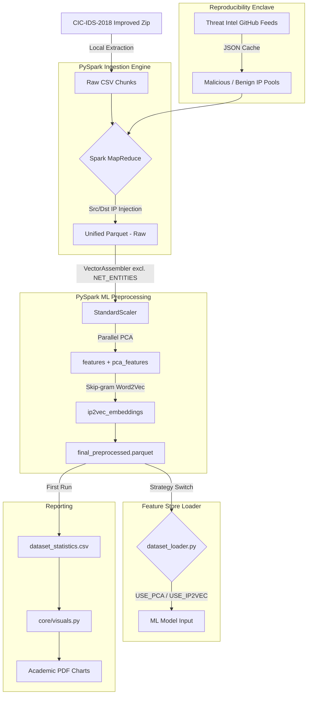

  <h1>CIC-IDS-2018 DDoS Enhanced Dataset Generator</h1>
  <p><h3>An autonomous, out-of-core pipeline for generating threat-intelligence-augmented synthetic PCAP datasets.</h3></p>

---

## 📌 Project Overview
This tool extracts the massive (~40-50GB uncompressed) **CIC-IDS-2018 improved dataset** and scales its preprocessing natively out-of-core using **PySpark MLlib**. The generator solves fundamental reproducibility and scalability issues:
1. **Zero OOM (Out-of-Memory)**: Bypasses Pandas' memory constraints by leveraging PySpark's parallel `Parquet` MapReduce mapping.
2. **Reproducible Threat Intel**: Fetches dynamic IPs from public Threat Intelligence repositories but caches them via `JSON` locally to guarantee stable downstream reproducibility across dataset generations.
3. **Pipelined ML Transform**: Standardizes data scaling and categorical encoding out-of-core immediately during ingestion.

---

## 🏗️ Architecture



---

## ⚙️ Core Components

| Component | Responsibility | Technical Stack |
| :--- | :--- | :--- |
| **`core/ingestion.py`** | Downloads dataset, handles unzipping. Reads raw daily CSVs using `SparkSession`, creates deterministic subnet IP pools, injects Threat feed indicators. Repartitions into out-of-core `unified_records.parquet`, tagging each row with `_source_day`. | PySpark SQL, UDFs |
| **`core/dataset_loader.py`** | **Feature Store**. Loads RAW 40GB dataset lazily, applies virtual schema strategies (`raw`, `unsupervised`, `binary_collapse`, `undersample_majority`), and evaluates `USE_PCA`/`USE_IP2VEC` flags to deliver the correct feature matrix to the model. | PySpark ML DataFrame |
| **`core/preprocessing.py`** | Label encoding (`StringIndexer`), continuous feature scaling (`StandardScaler`), parallel PCA projection (`pca_features`). Calls `ip2vec.py` for distributed Skip-gram embedding generation. Enforces `NET_ENTITIES` isolation list. | PySpark MLlib |
| **`core/ip2vec.py`** | Transforms discrete network routing tokens into continuous latent vectors via native PySpark `Word2Vec` (Skip-gram). Applies **Token Prefixing** (`Protocol_6` vs `DstPort_6`). Performs advanced offline IP geolocation (Country/Type) leveraging **MaxMind GeoLite2** databases, accelerated by **Apache Arrow** via vectorized Pandas UDFs (`@pandas_udf`). | PySpark ML, GeoIP2, Apache Arrow |
| **`core/visuals.py`** | Dedicated visualization engine. All output is academic-standard (serif fonts, minimal grid, 300 DPI PDF). Exposes `plot_dataset_statistics()`, `plot_pca_variance()`, `plot_training_curves()`. | matplotlib, seaborn |
| **`core/utils.py`** | General I/O utilities: cross-tabulation report generation, temp directory cleanup. | Python stdlib |
| **`configs/settings.py`** | Central declarative point for all experiment flags: `ML_CLASS_STRATEGY`, `USE_PCA`, `USE_IP2VEC`, `IP2VEC_SENTENCE`. | Constants |
| **`scratch_hpo.py`** | **Neural HPO Benchmark Suite**. High-performance search over MLP, ResNet, 1D-CNN, and Autoencoder architectures using Optuna and MLflow. | Optuna, PyTorch, MLflow |

---

## 🚀 Usage Guide

### 1. Requirements & Setup
Because the system runs on **PySpark**, your local environment must have Java runtime enabled.

```bash
# 1. Install Java (Linux/Ubuntu)
sudo apt install default-jre

# 2. Setup isolated environment
python3 -m venv .venv
source .venv/bin/activate

# 3. Install core Python dependencies
pip install -r requirements.txt
```

### 2. Execution & Configurations
Modify `configs/settings.py` to change dataset architectures. Available modes for ML Pipeline testing:

#### ML Base Strategies (`ML_CLASS_STRATEGY`)
- `"raw"` (For natively imbalanced XGBoost processing)
- `"unsupervised"` (Pulls only Normal traffic for Autoencoders)
- `"binary_collapse"` (Converts 14 attacks into 1 Boolean representation)
- `"undersample_majority"` (Dynamically downsamples Benign traffic to equal Attack frequency)

#### Neural Embeddings & Analytics Toggles
- `USE_PCA` (Exchanges massive raw feature arrays for PCA-compressed `pca_features`)
- `USE_IP2VEC` (Provides the `ip2vec_embeddings` vector column; `NET_ENTITIES` remain excluded from StandardScaler in either case)
- `IP2VEC_SENTENCE` (Context window token list for Skip-gram. Tokens are prefixed before training — `Protocol_6` and `DstPort_6` live in completely separate embedding subspaces, regardless of their numeric value)
  - Available tokens: `"Src IP"`, `"Dst IP"`, `"Src Port"`, `"Dst Port"`, `"Protocol"`, `"Src Region"`, `"Dst Region"`
  - `Src Region` & `Dst Region` are computed inline via offline **MaxMind GeoLite2** lookup. Execution is vectorized through **Apache Arrow** (`pyarrow`) for extreme performance over tens of millions of rows.

Run the system:
```bash
python main.py
```

Optional CLI overrides:
- `--days`: Array of days to process (e.g. `--days Monday-12-02-2018`)
- `--force`: Ignore cached IP feeds and local parquets, rewriting everything.
- `--sample`: Set integer to downsample the final table (e.g. `--sample 500000`)
- `--no-cache`: Prevents saving the final Parquet back to the system disk.

> [!TIP]
> **Dataset Distribution Matrix**
> On first pipeline execution, a PySpark Cross-Tabulation runs seamlessly generating `data/dataset_statistics.csv` printing the intersection of all ML Labels vs the specific extraction Day they appeared on, with horizontal/vertical Marginal counters.

### 3. Neural Architecture HPO (Optuna + MLflow)
A dedicated benchmarking suite is included to optimize hyper-parameters across multiple neural architectures.

```bash
# Run HPO with a 50% sample and 30 search trials
python scratch_hpo.py --trials 30 --sample 0.5
```

#### 🔍 Analytical Insights: Why IP2Vec?
Traditional network ML relies on **One-Hot Encoding** for Categorical entities (Ports, IPs). This suffers from:
1. **Dimensionality Curse**: Millions of unique IPs lead to sparse, unmanageable matrices.
2. **Loss of Semantics**: One-Hot treats all values as equidistant.

**IP2Vec (Distributed Representation)**:
- Learns embeddings via **Skip-gram Word2Vec** based on flow co-occurrence.
- **Duality**: Captures semantic similarity (e.g., ports 80/443 mapping closer than 80/22) in a low-dimensional manifold.
- **Dual-Head Optimization**: The `AutoencoderClassifier` architecture simultaneously minimizes reconstruction error (unsupervised anomaly detection) and cross-entropy (supervised classification), creating a more generalized latent space for zero-day detection.

---

> [!NOTE]
> **Data Integrity and Caching Pattern**
> 
> Threat Intelligence repositories block frequent scraping. To maintain reproducibility during ML modeling cycles, IP datasets are stored at `data/intel_cache/`. Delete `intel_cache` to force a new HTTP sweep and resample a totally different malicious injection topology.
