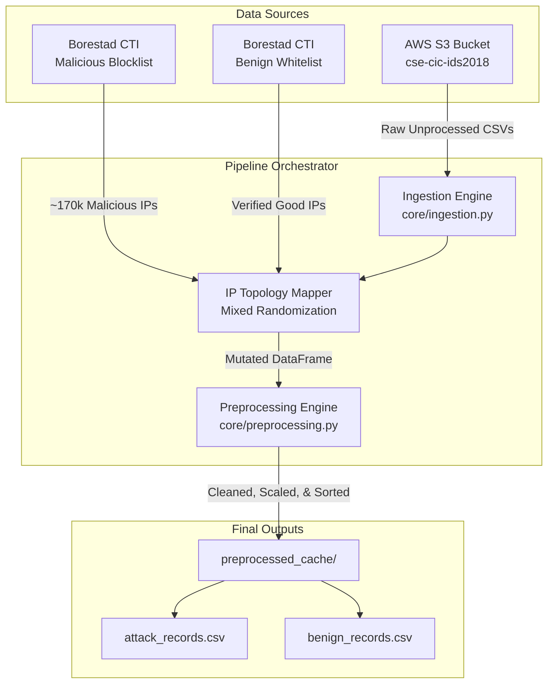

# synth-cic-ids-2018

## 1. Overview
An autonomous data augmentation pipeline with a single, focused purpose: **take the CIC-IDS-2018 pre-processed ML-ready CSV dataset and enrich each flow record with realistic, scoring-based IP addresses** derived from live Cyber Threat Intelligence feeds.

> **Architectural Note:** This pipeline operates **entirely without CICFlowMeter**. It consumes the pre-processed CSV files (`*_TrafficForML_CICFlowMeter.csv`) published by the Canadian Institute for Cybersecurity and hosted on the public AWS S3 mirror. No raw PCAP processing or packet capture tooling is required.

## 2. Objective
The official CIC-IDS-2018 pre-processed CSVs are ML-ready and labeled, but intentionally omit `Src IP`, `Dst IP`, and `Src Port` — fields that are specific to the CIC lab simulation environment and would cause data leakage and topology overfitting if exposed.

This pipeline fills that gap by replacing those columns with **live, verified CTI IPs assigned by abuse confidence scoring**: malicious flows receive IPs from active attacker blocklists; benign flows receive IPs from verified global service whitelists. All flow statistics and attack labels are preserved intact.

---

## 3. High-Level Architecture Flow

The pipeline operates completely autonomously, bridging remote CSVs and live intelligence feeds before conducting topological mutations.



---

## 4. Threat Intelligence Sources

This framework is strictly verticalized on the [`borestad`](https://github.com/borestad) repository ecosystem, which provides highly vetted and continuously updated lists of both malicious and benign actor IP addresses.

### 4.1 Malicious Seed (`borestad/blocklist-abuseipdb`)
A specialized repository aggregating the worst IPv4 & IPv6 offenders globally. 
* **Data Origin**: Synthesized directly from [AbuseIPDB](https://www.abuseipdb.com/) (with explicit permission).
* **Target Audience**: IP addresses with extremely high abuse scores (defined as `s100`, representing ~99%-100% confidence).
* **Update Frequency**: Multiple updates per day via automated GitHub Actions.
* **Temporal Slicing**: The repo exposes several subsets based on temporal recency (e.g., 1d, 7d, 14d, 30d, 90d, up to 365d). 
* **Implementation Choice**: This pipeline natively targets `abuseipdb-s100-30d.ipv4` (representing attackers active within the last 30 days). At any given time, this file exposes roughly **~145,000 to ~170,000 highly verified malicious IPs**.

### 4.2 Benign Seed (`borestad/iplists`)
A corollary repository aggregating definitive lists of verified corporate and service endpoint IPs.
* **Data Origin**: Compiled sets of known service infrastructures (e.g., search engine crawlers, trusted email relays, APIs).
* **Implementation Choice**: The pipeline targets major technological ecosystems (`googlebot`, `bingbot`, `apple`, `office365-exchange-smtp`) ensuring the benign flow traffic maps to legitimate and globally whitelisted addresses.

---

## 5. File Hierarchy & Structural Design

The repository is modularly designed to mimic a strictly analysis framework, avoiding monolithic scripts and focusing on discrete computational nodes.

```text
synth-cic-ids-2018/
├── configs/
│   └── settings.py          # Centralized static configuration (CTI Feeds URLs, AWS buckets, date arrays)
├── core/
│   ├── ingestion.py         # Handles autonomous S3 sync, Regex IP extraction, and Topology mapping logic
│   └── preprocessing.py     # Handles feature selection, label encoding, and dimensional reduction
├── data/
│   └── s3_csvs/             # Ephemeral local storage for the raw downloaded CIC-IDS-2018 CSVs
├── preprocessed_cache/      # Persistent output destination for the formulated datasets
├── pipeline_synth.ipynb     # Interactive experimental Jupyter environment mirroring main.py operations
├── cleanup.py               # Ephemeral utility script for safely purging legacy configuration files
├── main.py                  # Primary CLI entry-point
├── setup.sh                 # Environment bootstrap script (venv generation and dependency verification)
└── setup.py                 # Python package definitions and build parameters
```

---

## 6. Core Mechanisms Breakdown

### 6.1 Ingestion & Threat Intelligence (`core/ingestion.py`)
At the heart of the generator is the Topologic engine. Network traffic vectors are strictly segregated and manipulated according to their intended context. 

| Topology Context | Threat Intel Source | Behavioral Transformation |
| :--- | :--- | :--- |
| **Malicious Flow** | `blocklist-abuseipdb` (100% confidence pool) | The **Source IP** is stochastically replaced with an active, modern malicious host. The Destination is randomized between internal IPs and whitelisted public IPs to mimic reconnaissance or brute-forcing behavior. |
| **Benign Flow** | `iplists` (Google, Apple, Bing, Office365) | Both Source and Destination IPs are reassigned using a weighted distribution of Private RFC 1918 addresses and verified global whitelists, ensuring the model identifies "safe" traffic reliably. |

### 6.2 Preprocessing Pipeline (`core/preprocessing.py`)
A continuous transformation algorithm is automatically applied after the topology mapping:
1. **Sanitization**: Handles NaN and intrinsic Infinite values effectively normalizing invalid integers.
2. **Dimensionality Reduction**: Any columns holding zero variance (single values only) are proactively dropped to eliminate structural noise.
3. **Normalization**: Numerical attributes are internally fitted against a `StandardScaler` to ensure ML ingestion readiness.
4. **Encoding**: Categorical outputs (like raw Attack string definitions) are transformed via `LabelEncoder`.

---

## 7. Execution Protocol

Strict Python 3.10+ support is utilized alongside minimal essential dependencies (avoiding legacy Java/Spark bottlenecks).

**Automated Setup:**
```bash
source setup.sh
```

**Running the Pipeline:**
```bash
python main.py --days "Friday-02-03-2018"
```
Or utilize `--force` to overwrite the existing artifact cache.

**Interactive Alternative:**
To evaluate single-step flow changes visually, open the `pipeline_synth.ipynb` and execute locally.

---

## 8. Research Context & Motivation (`CheckDataset.ipynb`)

This section documents the exploratory analysis phase that preceded the pipeline design. It establishes the scientific rationale for topological augmentation.

### 8.1 Dataset Sources Compared

During preliminary analysis, two distinct dataset versions were cross-compared:

| Source | Format | Download Method | Notes |
| :--- | :--- | :--- | :--- |
| **AWS S3 Official Mirror** | `*_TrafficForML_CICFlowMeter.csv` | `aws s3 cp --no-sign-request` | Pre-labeled, officially maintained by CIC |
| **Kaggle Community Version** | `improved-cicids2017-and-csecicids2018` | Kaggle API | Re-processed, improved column schema |

Three representative days were analyzed: `Thursday-01-03-2018` (~102 MB), `Friday-02-03-2018` (~336 MB), `Wednesday-14-02-2018` (~341 MB).

### 8.2 Why the Official CSVs Omit IP Addresses — A Deliberate Design Choice

> **Reframing the Gap:** The absence of `Src IP`, `Dst IP`, and `Src Port` from the official CIC-IDS-2018 pre-processed CSVs is **not a flaw** — it is a **correct and intentional design decision** by the Canadian Institute for Cybersecurity.

The CIC-IDS-2018 dataset was generated inside a **controlled lab environment** with a fixed, synthetic network topology. The attacker and victim IPs present in that simulation are entirely **specific to the CIC lab infrastructure** (private address ranges, a small fixed set of AWS-hosted VMs). Publishing those IPs directly would cause two severe problems for the broader research community:

1. **Data Leakage**: Models trained on the lab's internal IP addresses would implicitly learn the topology of the CIC simulation rather than real-world threat patterns. Upon deployment against real network traffic, such models would be unable to generalize.

2. **Topology Overfitting**: Any classifier exposed to the CIC lab IPs would effectively memorize `{IP → label}` mappings rather than learning behavioral flow features. This renders the IP columns **actively harmful** for producing generalizable ML models.

| Column | CIC Decision | Rationale |
| :--- | :---: | :--- |
| `Src IP` | ❌ Omitted | Lab-internal; memorizing these would overfit to CIC simulation topology |
| `Dst IP` | ❌ Omitted | Lab-internal; exposes victim infrastructure specific to the simulated lab |
| `Src Port` | ❌ Omitted | Ephemeral port assigned by OS for connection uniqueness; subject to Src NAT — carries zero semantic signal and would cause data leakage |
| `Dst Port` | ✅ Retained | Service-level signal (e.g., 80, 443, 22); stable and generalizable |
| `Protocol` | ✅ Retained | Transport-level signal; universally applicable across environments |
| `Label` | ✅ Retained | Ground truth for supervised classification |

> **Note on `Src Port`:** In any realistic network deployment, source ports are ephemeral — selected pseudo-randomly by the OS TCP/IP stack and frequently remapped by NAT devices. A model that learns to associate specific source port ranges with attack labels from a controlled lab would fail entirely on real traffic that traverses NAT gateways. Including `Src Port` from the CIC lab would therefore constitute **source NAT data leakage** with no generalization value.

**The correct approach is therefore not to restore the lab IPs, but to replace them entirely with verified, real-world addresses** — which is precisely what this pipeline implements.

### 8.3 Synthetic CTI Injection

By discarding the lab's artificial IP topology and injecting IPs derived from live, verified threat intelligence sources, the resulting dataset achieves properties that the original simulation cannot provide:

- **Malicious flows** are attributed to IPs confirmed as active, real-world threat actors (AbuseIPDB `s100` confidence pool). A model trained on these associations learns behavioral patterns that map to genuine global adversary infrastructure.
- **Benign flows** are attributed to globally whitelisted infrastructure (Google, Apple, Microsoft, Bing). This forces the model to learn feature-level discrimination between safe and malicious behavior rather than relying on topology-specific IP memorization.
- **Flow statistics are preserved verbatim.** No packet counts, byte distributions, inter-arrival times, or flags are altered. Only the network attribution layer is replaced.

This approach eliminates both data leakage and topology overfitting risks while enabling meaningful **ip2vec embedding training**, where the semantic relationships between injected IPs reflect verifiable real-world network behavior.

### 8.4 ip2vec Applicability — Simulation vs. Real-World

| Scenario | ip2vec Applicable? | Rationale |
| :--- | :---: | :--- |
| Raw CIC-IDS-2018 CSVs (no IPs) | ❌ Severely limited | Only Protocol + Dst Port available (2-token feature space) |
| Lab IPs restored directly | ❌ Counterproductive | Overfits on private CIC simulation topology; generalizes to nothing |
| Random synthetic IPs injected | ❌ Meaningless | No real-world semantic relationship between arbitrary random addresses |
| **CTI-augmented dataset (this pipeline)** | ✅ **Viable** | Verified real-world IPs carry authentic relational structure exploitable by embedding models |

By re-injecting `borestad/blocklist-abuseipdb` IPs into attack flows and `borestad/iplists` IPs into benign flows, the resulting dataset supports meaningful **ip2vec embedding training** where IP address co-occurrence patterns reflect verifiable, real-world threat and service infrastructure relationships.

---

## 9. CIC-IDS-2018 Attack Taxonomy

The dataset covers the following attack categories across 10 days of traffic capture (Feb–Mar 2018):

| Day | Attack Type(s) |
| :--- | :--- |
| Wed 14 Feb | Brute Force – FTP, SSH |
| Thu 15 Feb | DoS – Slowloris, SlowHTTP, Hulk, GoldenEye |
| Fri 16 Feb | DoS – SlowHTTPTest; Heartbleed |
| Wed 21 Feb | Web Attacks – Brute Force, XSS, SQL Injection |
| Thu 22 Feb | Infiltration (Dropbox, Attempted) |
| Fri 23 Feb | Bot Activity |
| Tue 27 Feb | Infiltration (Portscan, Nmap) |
| Wed 28 Feb | DDoS – HOIC, LOIC, LOIC-UDP |
| Thu 01 Mar | Infiltration (Win Vista CVE Exploit) |
| Fri 02 Mar | Bot Activity (C&C + Lateral Movement) |

All attack labels are retained verbatim in the synthetic output and encoded via `LabelEncoder` during preprocessing.

