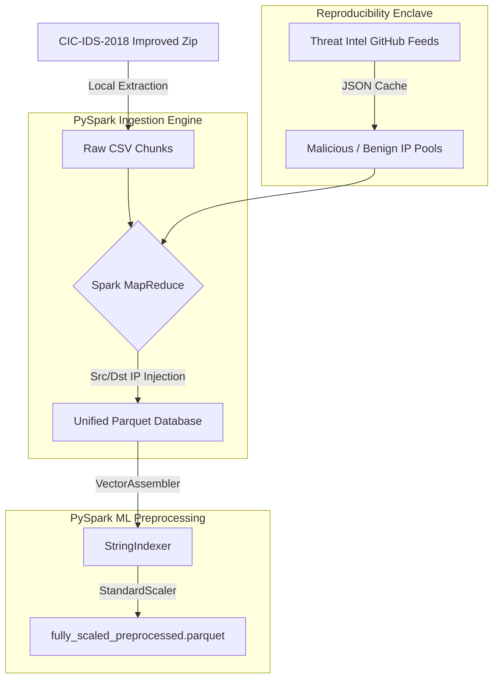

<div align="center">
  <h1>CIC-IDS-2018 DDoS Enhanced Dataset Generator</h1>
  <p><h3>An autonomous, out-of-core pipeline for generating threat-intelligence-augmented synthetic PCAP datasets.</h3></p>
</div>

---

## 📌 Project Overview
This tool extracts the massive (~40-50GB uncompressed) **CIC-IDS-2018 improved dataset** and scales its preprocessing natively out-of-core using **PySpark MLlib**. The generator solves fundamental reproducibility and scalability issues:
1. **Zero OOM (Out-of-Memory)**: Bypasses Pandas' memory constraints by leveraging PySpark's parallel `Parquet` MapReduce mapping.
2. **Reproducible Threat Intel**: Fetches dynamic IPs from public Threat Intelligence repositories but caches them via `JSON` locally to guarantee stable downstream reproducibility across dataset generations.
3. **Pipelined ML Transform**: Standardizes data scaling and categorical encoding out-of-core immediately during ingestion.

---

## 🏗️ Architecture



---

## ⚙️ Core Components

| Component | Responsibility | Technical Stack |
| :--- | :--- | :--- |
| **`core/ingestion.py`** | Downloads dataset, handles unzipping. Reads raw daily CSVs using `SparkSession`, creates deterministic subnet IP pools, and injects Threat feed indicators (e.g. `198.51.100.1`). Repartitions into out-of-core raw `unified_records.parquet` outputs per day, tagging each row with `_source_day`. | PySpark SQL, UDFs |
| **`core/dataset_loader.py`** | **SOTA Feature Store**. Loads the RAW 40GB dataset lazily and applies virtual schema strategies on-the-fly (`raw`, `unsupervised`, `binary_collapse`, `undersample_majority`). Math-based undersampling targets ensure Class Weights are perfectly controllable without dataset duplication. | PySpark ML DataFrame |
| **`core/preprocessing.py`** | Applies `StringIndexer` for Label encoding and native `StandardScaler` to the dynamic dataframe retrieved by the Loader. | PySpark MLlib |
| **`configs/settings.py`** | Central declarative point. Configure `ML_CLASS_STRATEGY` to control the Loader shape remotely. | Constants |
| **`main.py`** | Entry-point script orchestrating Python context switching sequentially. Also computationally dumps a `dataset_statistics.csv` Cross-Tabulation dataset distribution metric on first run. | Orchestrator |

---

## 🚀 Usage Guide

### 1. Requirements & Setup
Because the system runs on **PySpark**, your local environment must have Java runtime enabled.

```bash
# 1. Install Java (Linux/Ubuntu)
sudo apt install default-jre

# 2. Setup isolated environment
python3 -m venv .venv
source .venv/bin/activate

# 3. Install core Python dependencies
pip install -r requirements.txt
```

### 2. Execution & Configurations
Modify `configs/settings.py` to change `ML_CLASS_STRATEGY`. Available modes for ML Pipeline testing:
- `"raw"` (For natively imbalanced XGBoost processing)
- `"unsupervised"` (Pulls only Normal traffic for Autoencoders)
- `"binary_collapse"` (Converts 14 attacks into 1 Boolean representation)
- `"undersample_majority"` (Dynamically downsamples Benign traffic to equal Attack frequency)

Run the system:
```bash
python main.py
```

Optional CLI overrides:
- `--days`: Array of days to process (e.g. `--days Monday-12-02-2018`)
- `--force`: Ignore cached IP feeds and local parquets, rewriting everything.
- `--sample`: Set integer to downsample the final table (e.g. `--sample 500000`)
- `--no-cache`: Prevents saving the final Parquet back to the system disk.

> [!TIP]
> **Dataset Distribution Matrix**
> On first pipeline execution, a PySpark Cross-Tabulation runs seamlessly generating `data/dataset_statistics.csv` printing the intersection of all ML Labels vs the specific extraction Day they appeared on, with horizontal/vertical Marginal counters.

---

> [!NOTE]
> **Data Integrity and Caching Pattern**
> 
> Threat Intelligence repositories block frequent scraping. To maintain reproducibility during ML modeling cycles, IP datasets are stored at `data/intel_cache/`. Delete `intel_cache` to force a new HTTP sweep and resample a totally different malicious injection topology.
